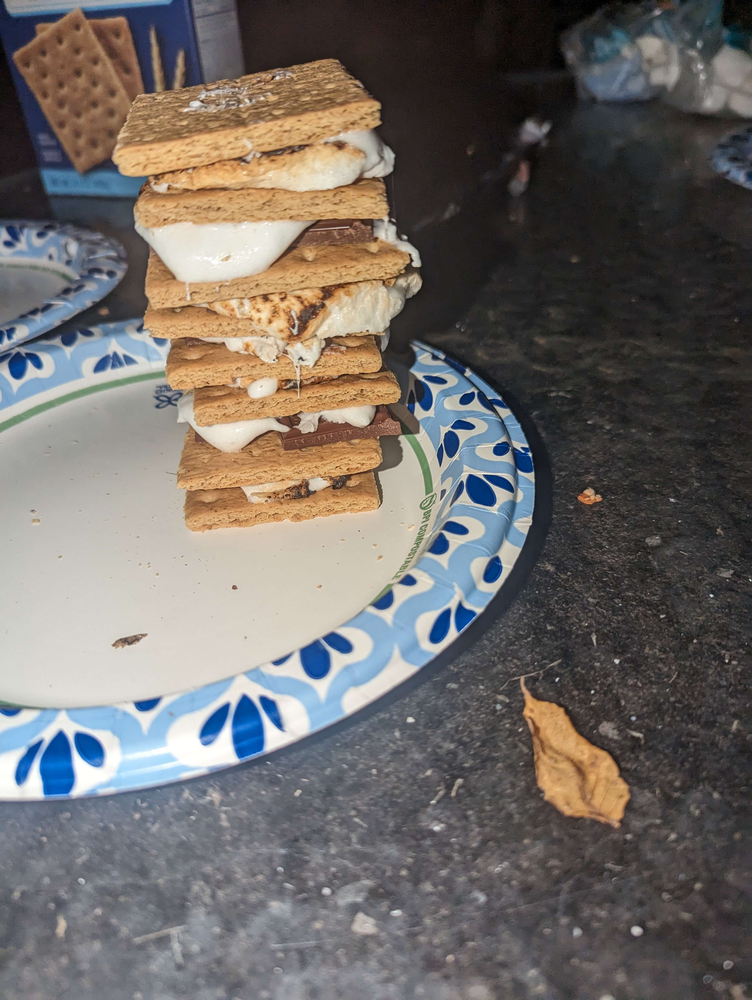

# Visual Cryptography Group Project (Python CLI)  
## Project Idea: Secret Image Sharing  

Build a command-line tool that splits a secret image into multiple meaningless-looking shares. Individually, the shares reveal nothing. When enough shares are combined, the original image is revealed.

## Core Features
encode: Generate shares from a secret image  
decode: Reconstruct the image from shares  
preview: (Optional) Show info about shares  
validate: Ensure correct inputs and formats  

## Recommended Scope  
### Base Requirement  
Black-and-white image visual cryptography  
2-out-of-2 scheme  
### Extension (choose ONE)  
3-out-of-4 scheme  
Text/QR: image secrets  
Authentication/watermarking  
Performance comparison  

## User Flow  
Input a secret image  
Convert to black/white  
Generate shares  
Combine shares to reconstruct  

# Place holder for a keyed share

# Work Distribution

## Person 1 — Algorithm & Cryptography - Zac
### Responsibilities:
Visual cryptography logic  
Pixel expansion rules  
Share generation  
Reconstruction logic  

### Deliverables:
Correctness tests  
crypto object with methods:  
encode_secret(...)  
decode_shares(...)  

## Person 2 — Image Processing - Dan
### Responsibilities:
Image I/O (PNG handling)  
Black/white conversion  
Resizing & formatting  
Pixel preprocessing  

### Deliverables:
Image utilities module  
Preprocessing pipeline  

## Person 3 — CLI & Integration - Ryan
### Responsibilities:
Command-line interface  
Argument parsing  
Error handling  
Program structure  

### Deliverables:
CLI commands  
Help menu  
Integration of modules  

## Person 4 — Testing & Documentation - Pop
### Responsibilities:
Test cases  
Sample images  
README and usage guide  
Demo & presentation  

### Deliverables:
Test plan  
Screenshots  
Final report/slides  
